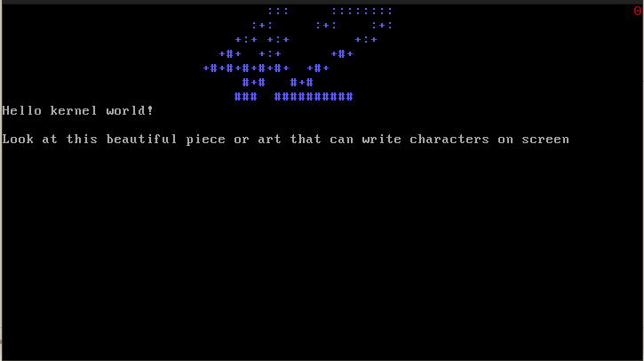

# KFS series

The purpose of this project is to write a kernel from scratch (hence the acronym) without any existing software, API or such, using the i386 architecture.

The KFS series is divided into many projects, each one dealing with a specific aspect of kernel programming. All those projects are linked together.

## Usage

A cross compiler is required to build this project. In the `cross-compiler` folder we included a few scripts that can be used as a source of inspiration. They are highly architecture-dependent so there is a very low probability that they will ever work as intended on another machine (tbh they barely work on ours).

The kernel is run in QEMU, in an Alpine container. A VNC server is started that can be accessed with the host computer using vncviewer (tigerVNC).

`make all` will nicely do all the work for us.

## KFS-1

### Grub, boot & screen

The purpose of this project is to have:
- A bootable kernel (via GRUB)
- An ASM bootable base that handles multiboot header
- Basic kernel functions
- A kernel that can print characters on screen

A few bonuses that were added:
- Scroll and cursor support to the I/O interface
- Colors support
- A few helpers like printf and so on
- Handling of key entries (with shift support but backspace is not currently supported)
- Handling of different screens (number of screens can be changed in `vga.h`, press `alt + screen number` to switch to a different screen)

The keyboard support is done with polling since we don't have a working IDT and GDT for now. We will switch to interrupts once we have a working IDT and GDT.

The screen support will also probably be modified or removed later on because it's pretty inefficient.

## KFS-2
### *WIP*
